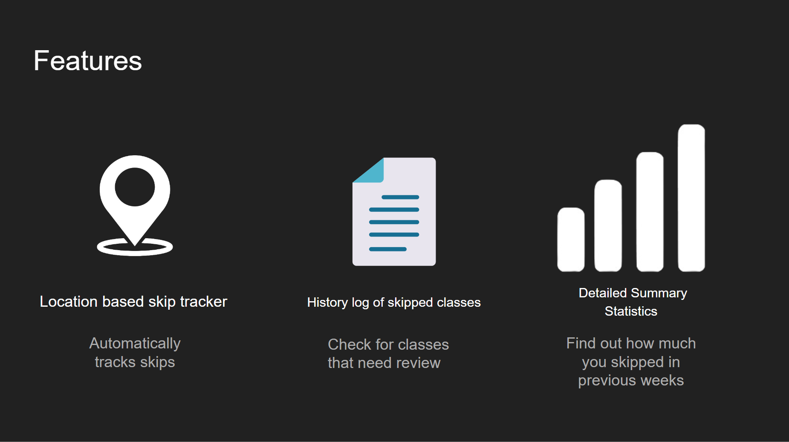
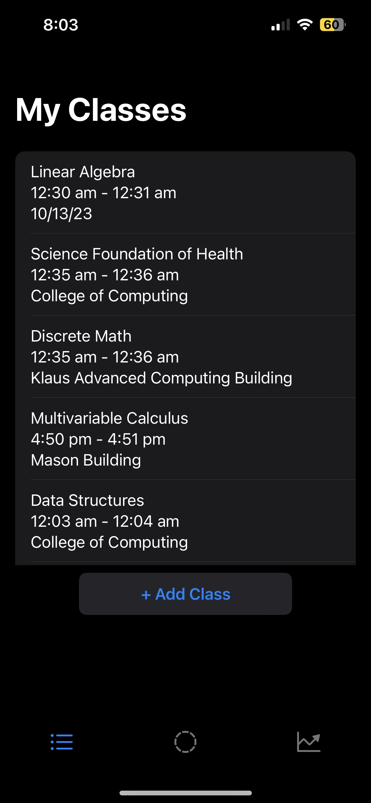
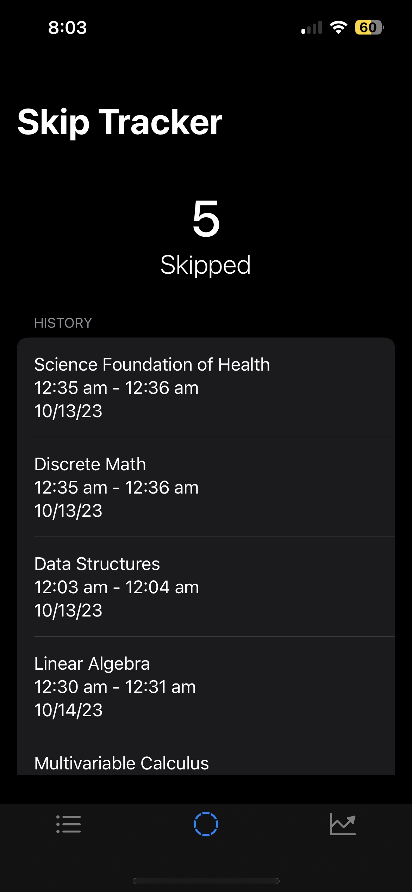
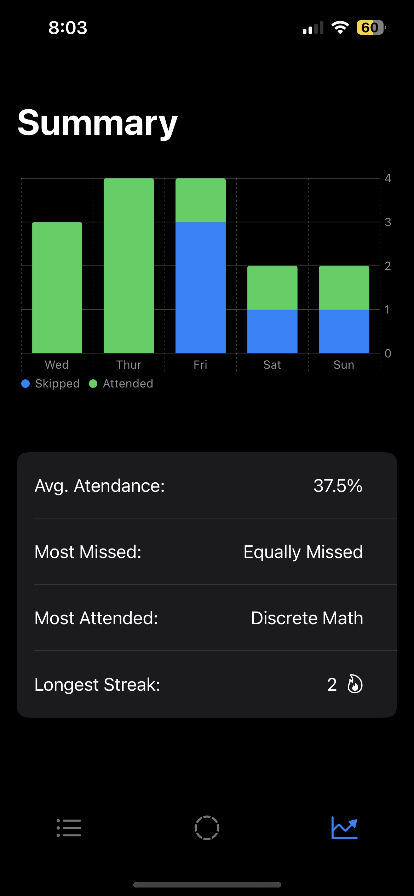

<!DOCTYPE HTML>
<html>
<head>

</head>
<body>
<h2 style = "text-align : center">PROBLEM</h2>
<pre>
<h3 style = "text-align : center;">Why do we <em>FAIL</em> to stick to our goals? <h3>
<h3 style = "text-align : center;">What happened to the drive you had in the beginning?</h3>
It's all because of <b>INCONSISTENCY.</b>
 
You give yourself breathing room by skipping one class, which validates skipping two.. validating more and more
</pre>

</img>

<h2>FEATURES</h2>
</img>

<h2>USER INTERFACE</h2>

</img>
</img>
</img>

</body>
</html>

