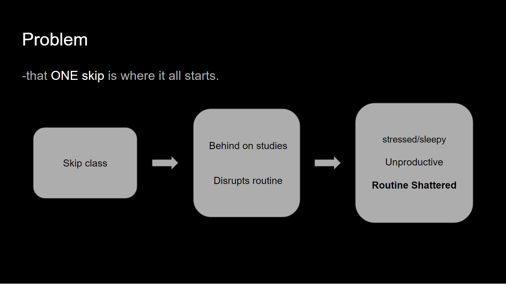

<!DOCTYPE HTML>
<html>
<head>
</head>
<body>
<h2 style = "text-align : center">PROBLEM</h2>
<pre>
<h3 style = "text-align : center;">Why do we <em>FAIL</em> to stick to our goals? <h3>
<h3 style = "text-align : center;">What happened to the drive you had in the beginning?</h3>
It's all because of <b>INCONSISTENCY.</b>
if you skip one class, you validate skipping two,three,and more
This slows down progress, decreases motivation.
</pre>

</img>

<h2>FEATURES</h2>
</img>

<h2>USER INTERFACE</h2>

</img>
</img>
</img>

<h3>Potential Developments </h3>
<pre>
i) Functional Features
-Data filtering: how many classes you missed for each subject. 
-priority assignment- set priority levels for tasks, generate a to-do list/punishment upon skipping.
-Reminders: get reminded on what subjects/topics to work on.
-Syllabus scraping: have AI scan assignments for each class to inform the user what they need to do.
 ii) Social Features 
-Friends feature - check friends’ progress, compete for reward points and collaborate for shared academic projects.
-Scope expansion: let user create different categories of tasks.(e.g. school, gym, reading)

</pre>
</body>
</html>

